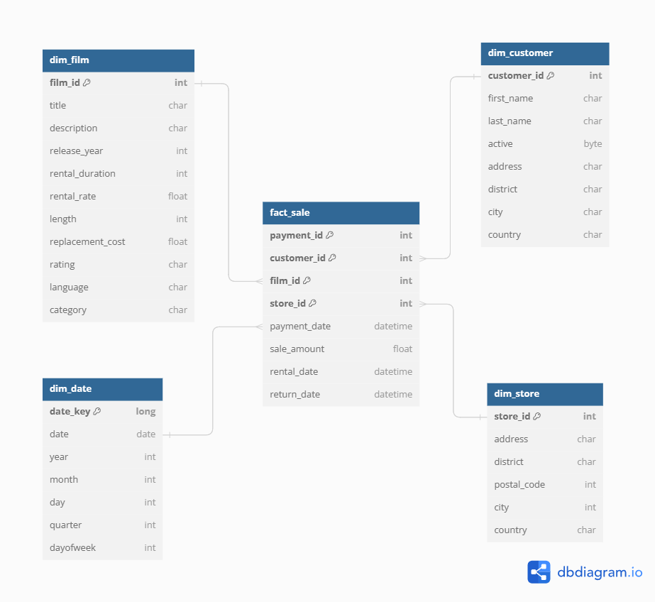

## ETL-pyspark-airflow-postgres
This project involves creating a scalable batch data ETL pipeline and modelling a data warehouse, with the source being an S3 bucket and the destination being a postgreSQL datebase. The data is obtained from a sample database dataset.

### Extract
Data passes through a scheduled data etl pipeline to be loaded into a data warehouse
